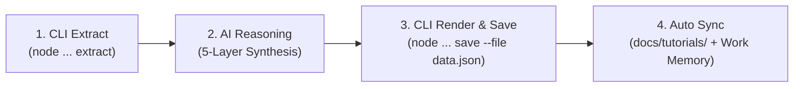

# Knowledge Distiller & Daily Learning Synthesizer Skill

This skill guides the AI in distilling real-world porting tasks, bug fixes, and architecture decisions into **crisp, 5-layer daily tutorials** comparing Unity and Cocos Creator 3.8, enriched with beautiful code formatting and Mermaid diagrams.

---

## 1. Token-Efficient Workflow (Script-Heavy, AI-Light)

To minimize token usage, the AI agent delegates log extraction, markdown rendering, diagram PNG export, and Work Memory sync to the CLI tool.



---

## 2. Standard 3-Step Execution Procedure

### Step 1: Extract Compact Context Digest
Run the CLI tool to automatically scan transcripts, git diff, and work memory:
```bash
node playable-shared-kit/tools/knowledge-distiller.cjs extract
```
*Output: Ultra-compact JSON summary saved to `docs/tutorials/.last-digest.json`.*

---

### Step 2: AI Thinking & 5-Layer Synthesis
Synthesize the technical lesson using the **5-Layer Architecture**:

1. **🎯 1. Tổng Quan & Vấn Đề (Core Concept & Challenge)**:
   - 1-2 clear sentences explaining the problem, game mechanic, or bug fix.
2. **⚖️ 2. Ma Trận So Sánh Input (Unity) vs Output (Cocos Creator 3.8)**:
   - Unity C# / Inspector / Physics / Shader vs Cocos Creator 3.8 TypeScript / JSON Config / `@property` / `.effect`.
   - Side-by-side comparative table.
   - Code snippets highlighting Zero-GC compliance (e.g. `Vec3.set(_tempVec3, x, y, z)`).
3. **📊 3. Sơ Đồ Kiến Trúc & Luồng Xử Lý (Visual Architecture)**:
   - Clean Mermaid flowchart or sequence diagram.
4. **⚠️ 4. Bẫy Tiềm Ẩn & Quy Tắc Hiệu Năng (Traps & Performance Rules)**:
   - Common pitfalls (GC in `update(dt)`, touch events on 3D nodes without UI transform, AudioContext unlock on iOS Safari).
5. **💡 5. Đúc Kết Bài Học Nhanh (Daily Actionable Takeaways)**:
   - 3 bullet points for 5-minute daily learning.

---

### Step 3: Render, Export Diagram & Save to Knowledge Base
Write a JSON payload file (e.g. `tutorial-payload.json`) and run:
```bash
node playable-shared-kit/tools/knowledge-distiller.cjs save --file <path_to_json>
```

#### JSON Payload Format Template:
```json
{
  "title": "Porting Unity Physics & Rigidbody Sang Cocos Creator 3.8",
  "slug": "unity-physics-to-cocos-38-zero-gc",
  "category": "physics",
  "tags": ["unity", "cocos3.8", "physics", "rigidbody", "zero-gc"],
  "objective": "Chuyển đổi logic Rigidbody từ Unity sang Cocos 3.8 với Zero-GC.",
  "comparisonRows": [
    "| **Lực đẩy / Impulse** | `rb.AddForce(dir * f, ForceMode.Impulse)` | `this._rb.applyImpulse(dir)` | Cocos dùng applyImpulse |",
    "| **Va chạm** | `OnCollisionEnter` | `collider.on('onCollisionEnter', cb)` | Listener nằm trên Collider |"
  ],
  "unityCode": "// Unity C# snippet...",
  "cocosCode": "// Cocos 3.8 TypeScript snippet...",
  "mermaidDiagram": "flowchart TD\n  A[Unity Input] --> B[Cocos Output]",
  "traps": [
    "Không cấp phát new Vec3() trong update()",
    "Luôn gỡ event listener trong onDestroy()"
  ],
  "takeaways": [
    "1. Dùng static pre-allocated Vec3 cho physics impulse.",
    "2. Đăng ký listener trên Collider thay vì RigidBody.",
    "3. Cấu hình thông số lực qua playable-config.json."
  ],
  "workMemoryPayload": {
    "scope": "global",
    "category": "porting-note",
    "title": "Unity Rigidbody to Cocos 3.8 Zero-GC Physics Rule",
    "content": "Use RigidBody.applyImpulse with static cached Vec3 and attach event listeners on Collider."
  }
}
```

---

## 3. Quick CLI Commands

- **Scan & Extract**: `npm run ai:distill -- extract`
- **List All Tutorials**: `npm run ai:distill -- list`
- **Run Seed Demo**: `npm run ai:distill -- test-render`
- **Open Playbook Hub**: `npm run playbook`
