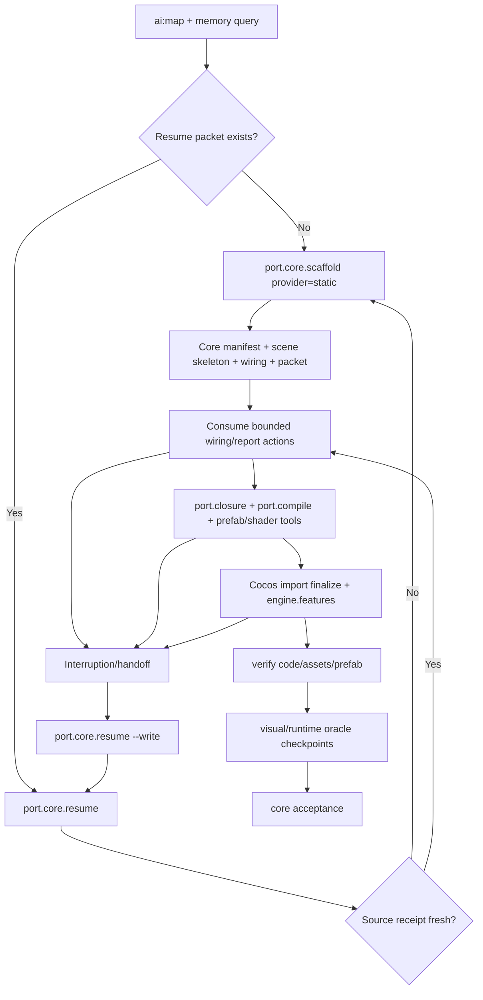

# Kế hoạch hardening workflow port Unity → Cocos playable

## Mục tiêu

Workflow phải đưa một agent mới từ Unity project tới Cocos skeleton có thể tiếp tục refine trong một lượt ngắn, giữ đủ bằng chứng để resume sau interruption, và chặn các lỗi đã lặp lại ở TapeJam trước khi chúng xuất hiện trong preview.

Thứ tự ưu tiên:

1. Không lặp lại lỗi làm mất visual hoặc gameplay.
2. Agent biết đúng entrypoint, output cần đọc và gate cần chạy mà không cần tự khám phá toolchain.
3. Static parser tạo skeleton, wiring và report compact trước; Unity-MCP/Cocos-MCP chỉ xử lý uncertainty hoặc mutation cần Editor.
4. Mọi lượt dở dang có resume packet bền vững trên disk.
5. Token/usage được giới hạn bằng digest và bounded evidence query, nhưng không hạ fidelity để tiết kiệm usage.

## Những lỗi lặp lại đã quan sát

| Nhóm | Triệu chứng | Nguyên nhân workflow | Guardrail trong shared kit |
| --- | --- | --- | --- |
| Shader/effect | Effect compile fail, std140/UBO sai, property Unity còn sót | Transpile được coi như hoàn tất mà chưa validate | `shader.convert` bắt buộc đi cùng `shader.validate`; analyzer bắt arity, symbol, UBO và backend surface/unlit |
| Material state/color | Tape đỏ thành nâu đen, material theo ScriptableObject bị mất | Chỉ dùng embedded FBX texture hoặc tint slot 0 | `shader.chain` nhận prefab và `.asset`, porter remap toàn material slots, visual checkpoint so texture identity |
| TypeScript scaffold | `Number` dùng trong `@property`, syntax/TODO lọt vào scene | Static translation thiếu Cocos decorator/type contract | `port.compile` type-check với `cc.d.ts`, scaffolder/porter có test decorator và report semantic |
| Scene wiring | GameManager/component chưa wire dù file TS tồn tại | Tool chỉ tạo geometry nhưng report không được tiêu thụ | Static scaffold luôn sinh `.scene` + wiring; resume packet đưa tối đa 8 task quan trọng vào `nextActions` |
| Asset import | Root meta imported nhưng subMeta mesh/material chưa import | Chỉ kiểm root importer state | `verify.assets` và porter finalize duyệt đệ quy `subMetas`, refresh Cocos-MCP rồi fail closed |
| Feature cropping | Graphics/physics/animation API thiếu ở preview | Blind workaround hoặc profile đổi nhưng chưa serialize/apply | `engine.features` thử Profile API có giới hạn, fallback CAS patch `engine.json`, restart Editor, chỉ complete khi preview import map khớp |
| Physics backend | Chọn backend theo tên PhysX thay vì hành vi | Mapping theo branding engine | Builtin/Cannon/Bullet được chọn theo collider, rigid-body, CCD, sweep, controller và constraint thực dùng |
| Model transform | Holder/slot/tape quay ngược, mounted FBX lệch 180° | Trộn basis conversion và local attach rotation | Porter giữ inverse mounted-child basis; runtime input test riêng ngang/dọc và attach transform |
| Camera/input | Drag ngược hoặc quay quá nhanh; zoom/reset sai | Suy dấu handedness, dùng snapshot runtime làm default | Gesture thật cả hai trục, normalized zoom oracle, reset quaternion theo source |
| UI fidelity | Font/progress/Unlock/waiting row lệch | UI được dựng lại theo cảm tính, thiếu source checkpoint | Visual matrix theo aspect/checkpoint, source sprite/font/material binding được ghi thành nghĩa vụ |
| Async lifecycle | Callback level cũ mutate level mới; win receipt thiếu | Tween/schedule không giữ generation/model ownership | Generation token + model identity, clear reference ngay sau destroy, QA driver serialize pending phases |
| Preview MCP | Profile/feature thay đổi nhưng Editor không persist | Tool tin response API hơn state trên disk/runtime | Cocos-MCP tool có receipt; fallback project settings; restart bằng `1_open-project.bat`; verify preview state |
| Resume/context | Agent đọc lại toàn project hoặc báo gần xong khi Editor khác trạng thái | Không có persisted phase/blocker packet | `port.core.scaffold` tạo packet; `port.core.resume --write` refresh manifest hash, receipt, wiring/report digest và next actions |

## Golden workflow



### Lượt mới

```bash
npm run ai:map
npm run memory:query -- "<gameplay mechanic or known trap>"
npm run ai:port:core:scaffold -- --unity-project <UnityProjectRoot> --cocos-project <CocosProjectRoot>
```

`scaffold` mặc định dùng static provider. Nó chạy preflight, khóa core entry/closure, tạo scene skeleton và wiring report, rồi ghi `.ai/port/resume-packet.json`. Unity-MCP chỉ được bật khi preflight trả uncertainty cụ thể không thể giải bằng static evidence.

### Lượt tiếp tục

```bash
npm run ai:port:core:resume -- --unity-project <UnityProjectRoot> --cocos-project <CocosProjectRoot>
```

Agent đọc `phase`, `sourceFresh`, `staticFirst`, `reports`, `implementation.checkpoints` và `nextActions`. Không đưa raw `port-report.csv` vào prompt. Không đọc whole-project source trước khi bounded packet yêu cầu một evidence slice cụ thể.

### Trước interruption/handoff

```bash
npm run ai:port:core:resume -- --unity-project <UnityProjectRoot> --cocos-project <CocosProjectRoot> --write
```

Packet giới hạn 8 wiring tasks, 8 report codes và 8 next actions. Nó lưu manifest hash, Unity state fingerprint và source receipt để lượt sau phát hiện stale context thay vì tiếp tục trên source đã đổi.

## Static-first contract

Static stage phải sinh đủ bốn artifact:

- `.ai/port/core-gameplay.json`: scope, exclusions, acceptance rubric và evidence contract.
- Cocos target `.scene`: node/component geometry skeleton, không giả vờ đã wire asset/runtime logic.
- `.ai/port/static-scaffold.wiring.json`: unresolved scripts, materials, prefabs, fonts, animation, particle và node references.
- `.ai/port/static-scaffold.receipt.json`: bind Unity brief/state fingerprint với SHA-256 của scene và wiring, chặn reuse output cũ sau khi source hoặc skeleton đổi.
- `.ai/port/resume-packet.json`: compact phase/report/next actions cho handoff.

Static stage không được overwrite target hoặc wiring đã tồn tại. Một nửa artifact tồn tại được coi là trạng thái cần review, không phải lý do để regenerate mù.

## Token và usage budget

Token budget là guardrail, không phải acceptance criterion:

- Luôn đọc resume packet trước raw source.
- Port report chỉ đi qua digest gộp theo code/severity/action.
- Wiring chỉ project 8 task đầu; full wiring ở disk dành cho lookup theo task.
- Preflight chỉ query section được liệt kê trong `evidenceQueries`.
- Live MCP chỉ dùng cho unresolved serialized data, Editor mutation/refresh hoặc runtime state mà static parser không thể quan sát.
- Visual/runtime evidence lưu thành receipt và screenshot path; không gửi lại hàng loạt ảnh giống nhau qua nhiều lượt.

## Regression gates

Mỗi thay đổi shared kit thuộc workflow port phải qua:

1. `node --check` cho CLI mới/sửa.
2. Unit test của core scaffold/resume, porter, shader, verifier, memory và Cocos-MCP tương ứng với diff.
3. `npm run ai:sync` và `npm run ai:contract:verify` để chống doc/CLI drift.
4. `git diff --check`, kiểm source/dist parity của Cocos-MCP và không commit DB/cache/backup cục bộ.
5. Smoke test `--help`/dry-run cho golden entry; dry-run không được tạo directory/file.
6. Với project áp dụng thật: `ai:verify`, `ai:lint`, asset/prefab/runtime/visual gates theo thay đổi. Build chỉ chạy khi acceptance/bundle verification được yêu cầu; không dùng build để chữa preview.

## Kế hoạch triển khai

### Phase A — hoàn tất trong thay đổi này

- Thêm `port.core.scaffold` làm entrypoint static-first.
- Thêm `port.core.resume` và persisted resume packet bounded.
- Đưa rule static-first/resume vào capability contract và porting skill.
- Thêm regression tests cho packet size, path redaction, source stale, report digest và static provider mặc định.
- Gom các fix TapeJam vào targeted test matrix trước khi merge main.

### Phase B — áp dụng ở 2–3 port kế tiếp

- Đo thời gian từ kickoff tới skeleton, số raw files agent phải mở, số lần live MCP escalation và số lỗi high bị bắt trước preview.
- Bổ sung auto-refresh packet sau `port.prefab`/`port.compile` nếu tool có đủ Unity project provenance; không đoán project từ path ngoài receipt.
- Chuẩn hóa visual source checkpoint manifest từ Unity screenshots và runtime oracle cho camera/input/material state.

### Phase C — promotion gate

- Golden workflow chỉ được coi ổn định sau ít nhất ba project khác nhau, không có lỗi high cùng code tái xuất hiện sau khi guardrail tương ứng đã được thêm.
- Mỗi lỗi lặp lại phải có regression fixture; chỉ thêm instruction khi lỗi không thể kiểm tự động.
- Thống kê resume packet phải chứng minh agent tiếp tục được mà không scan lại whole project.

## Chỉ số nghiệm thu

- 100% port mới có core manifest, wiring và resume packet trước refine thủ công.
- 0 report `high` bị bỏ qua khi kết luận runnable.
- 0 target scene/wiring bị static scaffold overwrite ngoài ý muốn.
- 0 absolute project path hoặc raw source dump trong resume packet.
- Cocos-MCP source/dist parity sạch và feature/backend chỉ được coi applied khi preview receipt khớp.
- Mỗi lỗi mới có action code và test; lỗi đã có guardrail mà tái xuất hiện làm quick test/acceptance fail.
