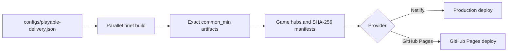

# Playable Delivery



## First setup

1. Edit `configs/playable-delivery.json`: group brief IDs under `hubs`, set
   `jobs`, and choose `delivery.provider` (`netlify`, `github-pages`, or `none`).
2. For Netlify, set `NETLIFY_AUTH_TOKEN` and `NETLIFY_SITE_ID`. In GitHub
   Actions add them at **Settings > Secrets and variables > Actions**.
3. GitHub Actions builds require a Windows self-hosted runner with the project's
   supported Cocos Creator version installed. GitHub Pages publishing itself
   uses a hosted Ubuntu runner. For the first GitHub Pages deploy, select
   **Settings > Pages > Build and deployment > Source: GitHub Actions** once.

## One-command local delivery

```powershell
npm run delivery
```

Useful safe modes:

```powershell
npm run delivery:prepare   # build and package; do not publish
npm run delivery:verify    # read-only hash and inventory verification
npm run delivery -- --dry-run
```

## One-click CI delivery

Open **Actions > Playable Delivery > Run workflow**, select the provider and
worker count, then run it. `package-only` produces a downloadable site artifact
without publishing.

The site root lists every configured hub. Each hub retains the selected brief
order and Previous, Replay, Next controls. Deployment starts only after all
brief artifacts and generated hub hashes pass verification.
